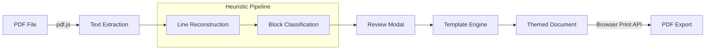

# Document Generator Workbench

> A client-side workbench that imports PDFs, extracts and classifies their content with heuristics, and renders professionally formatted documents across multiple visual themes — all in the browser, with no server.

## The Problem

Organizations that produce institutional reports, proposals, diagnostics and CRM analyses often start from unstructured PDFs. Turning that raw content into a polished, consistently branded document means manual copy-pasting, reformatting and layout work every single time. The process is slow, error-prone and scales badly when you have seven different document types, each with its own structure.

## The Solution

A zero-backend workbench built as a single HTML + CSS + JS application. The user drops a PDF (or fills in fields manually), and the system extracts text, classifies content blocks, and generates a ready-to-print document with the correct layout for the selected document type and visual theme.



### Document Types

Each type has its own schema (default sections, labels, layout components):

- **Relatório Executivo** — executive summary, KPI highlights, numbered sections
- **Parecer Institucional** — formal opinion with signature block and evaluation matrix
- **Diagnóstico** — diagnostic hero section with structural findings grid
- **Proposta** — proposal with scope/timeline/investment metadata and roadmap
- **Síntese Estratégica** — strategic callout cards with priority ranking
- **Relatório de Impacto** — impact narrative with metrics panel and timeline
- **Relatório de CRM** — temperature segmentation, funnel visualization, analytical tables

### Visual Themes

- **Grafite** — dark background, gradient sidebar, maximum contrast
- **Editorial** — white background, refined typography, orange accent line
- **Navy** — deep institutional blue, teal accents
- **PDF Mode** — presentation-style layout with bold gradient bar

## Technical Highlights

- **Dual-CDN fallback for pdf.js**: dynamically loads from cdnjs with an 8-second timeout, then falls back to jsdelivr. Avoids `<script integrity>` which fails silently on hash mismatch.
- **Spatial text reconstruction**: groups raw PDF text items into lines using x/y coordinates and font height, then merges lines into editorial blocks based on gap analysis, font size ratios and indentation.
- **Heuristic block classification**: each block is scored for type (summary, section, highlight, table, matrix, comparison, next steps, note) using uppercase ratio, lexical density, sentence-likeness, numbered heading patterns and keyword matching. Confidence levels (high/medium/low) control downstream formatting decisions.
- **Editorial preservation mode**: instead of aggressively reformatting imported content, the system can preserve the original block order and paragraph flow, only applying visual components when there's strong evidence.
- **Full review modal**: before applying extracted content to the template, users can reclassify block types, merge/split blocks, reassign editorial roles (heading, body, table row, noise), toggle blocks on/off, and manually edit text.
- **Print-faithful export**: uses `print-color-adjust: exact`, font preloading via `document.fonts.ready`, and a double-`requestAnimationFrame` flush before triggering `window.print()`.
- **Table detection from raw text**: recognizes tabular structures via multi-separator analysis (tabs, double-spaces, pipes, slashes, em-dashes) and key-value patterns, then renders them as styled HTML tables.

## Stack

- **Language**: Vanilla JavaScript ES6+ (~3,700 lines)
- **Styling**: Pure CSS with custom properties for theming (~2,400 lines)
- **PDF Processing**: pdf.js 3.11.174 (loaded dynamically from CDN)
- **Fonts**: Google Fonts — Nunito, Nunito Sans
- **Export**: Browser Print API with CSS print media optimization
- **Dependencies**: None (no build step, no npm, no framework)

## Usage

1. Open `document-generator-workbench.html` in a browser.
2. Either drag-drop a PDF onto the page or fill in the fields manually.
3. Select a document type and visual theme from the left panel.
4. Click **Gerar Documento** to render the preview.
5. Click **Exportar PDF** to print/save as PDF.

To load the built-in example automatically, append `?example=1` to the URL.

For autotest with a specific type and theme:

```
?autotest&type=crm&theme=navy
```

> No API keys or external services required. Everything runs client-side.
